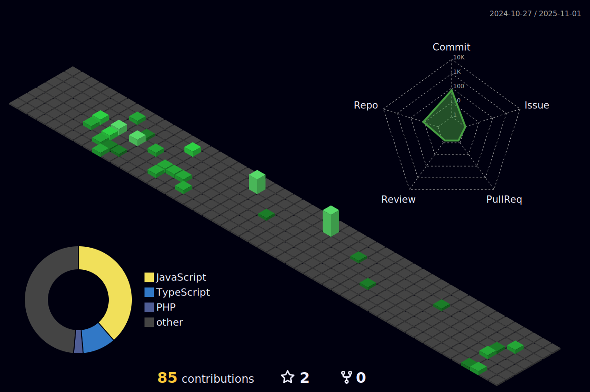

<!-- View Count -->

  

<!-- Name & Roles -->
<h1 align="center">Minhaj Karim</h1>

  🚀 Full-Stack Developer • 📱 Mobile App Developer • 🖥️ Desktop App Developer

---

### 👋 About Me

- 💻 Building scalable and efficient digital products
- 🌍 Based in Pakistan, working with global clients
- 🔧 MERN Stack • React Native • Electron.js
- 📚 Always learning new tools and best practices
- 🎥 Creator @ [Hunza EcoVibes](https://www.youtube.com/@hunzaecovibes)

---

### 🧠 Skills & Technologies

  

---

### 📚 Currently Exploring

  

---

### 🌐 Connect With Me

  
  
  
  

---

### 🧊 3D Contribution Graph

> Generated by [github-profile-3d-contrib](https://github.com/yoshi389111/github-profile-3d-contrib)

  

---

### 📈 GitHub Stats

  
  
  

---

### 🔍 Explore My Work

  <a href="https://github.com/Minhajkarim?tab=repositories">📌 View All Repositories</a>

